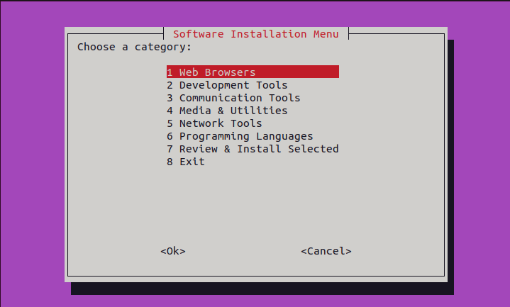
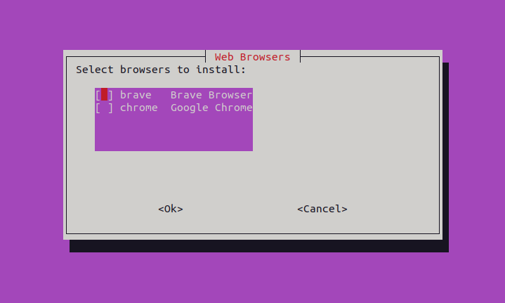
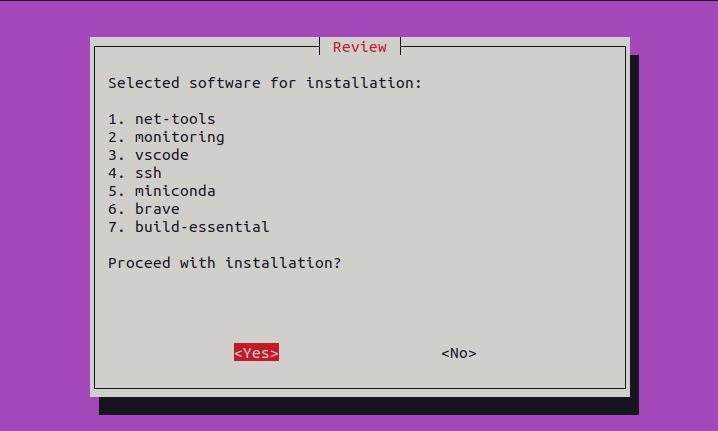

# Batch Install Script

This script will allow users to install multiple apps on single run.
It will be helpful to students or users who are setting up linux system for the very first time.

Don't forget to check out some of the comments in the scripts.😉

If you like you can also contribute to it 😊

## Installed Programs
The script installs the following programs:
1. **Web Browsers**: Google Chrome, Brave
2. **Development Tools**: build-essentials, VSCode, GIT, GitHub-CLI, GitHub Desktop (unofficial), Miniconda3
3. **Communication Tools**: Discord, Anydesk
4. **Media & Utilities**: VLC, FileZilla, VirtualBox
5. **Network Tools**: net-tools, Wireshark, SSH, Telnet, Monitoring-Tools
6. **Programming Languages**: Python3, Node.js, Java17

## Screenshots

## Contributed by [thatbackendguy](https://www.github.com/thatbackendguy)
